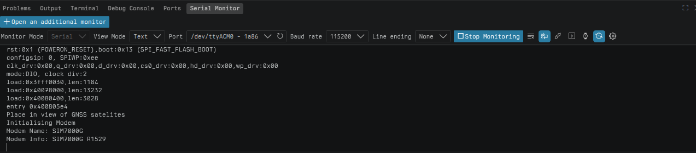

# WatchKeeper
WatchKeeper keeps a close watch over owned assets.

# Plan
1. Get T-SIM7000G reporting data (GPS position, temperature, battery etc) in JSON format over cellular network with MQTT to VPS.
2. Get T-SIM7000G onbaord logic to detect if GPS position is outside of user defined boundary radius (eg 50m from set location).
3. Push email if onboard logic flags parameters become out of bounds with time stamp
4. Develop Progressive Web Application and user interface

## Features and Status
- Onboard geofence logic to alert if departed a defined "home" radius.
- Heartbeat battery voltage and last heard since
- IMU impact detection
- Temperature and humidity sensor integration for dew point calculation
- Automatic route report

## To Do
- Send hello world JSON test via cellular

## Progress Report
- 29 September 2026:
Tested out secrets.h for the first time and writing my own.
- 23 September 2026:
Got T-SIM to print GPS position to terminal.
- 22 September 2026:
Initialised T-SIM modem to report back modem name and modem info.

- 21 September 2026:
Got T-SIM to blink LED on pin12 to prove device still works.
- July, August and September 2026:
A bit of mixed progress months. Was able to get the T-SIM to publish a psudo-JSON and get delivered to my email as well as getting the GNSS to print to the terminal the lat and long of the device. Wasn't able to keep the progress up due to other commitments and in that time certificates expired. In reviewing what I had previously done I realised I had published wifi credentials to the repo so decided to delete the repo and start afresh. Really going to be working on what is the next minimum step to keep the progress up. Expect more commits as last few had made good progress by following some good tutorials, now moving forward will be to condense what took a few months into a few days.
- 6 June 2026:
Subdomain configured on owned domain for MQTT messages back to VPS.
- 4 June 2026:
Set up VPS today. Configured firewall and ssh settings. Next is docker and wireguard on the VPS then spinning up the Mosquitto container. Then seeing test messages landing on my Optiplex after being sent from my laptop via the VPS.
- 1 June 2026:
Configured Mosquitto to work with usernames and passwords. Generated TSL certifcates for Moquitto and configured the .config file to enable testing with MQTT Explorer. Was able to connect, send and recieve. Some file permission issues to overcome while in this V1. (My V1s are typically just getting each element working even if it is messy, V2s will be in a publishable state for others to start using.)
- 31 May 2026:
Got first container running Mosquitto broker and subscriber displaying incoming messages from publisher tests.
- 30 May 2026:
Docker installed on home server.
- 23 May 2026:
Setup Dell Optiplex 3050 SFF with Ubuntu Server LTS and wired into home network. Set static IP address and confirmed maintaining address with SSH connection after reboots.

## Learning Log
- 20 May 2026:
First introductuon to MQTT, Node-RED and VPS.
- September 2026:
Reading Eloquent JavaScript

Making good progress so far. I have a VPS and node-red instace set up now which is emailing me all JSONs that are published to the /test topic on the MQTT broker.